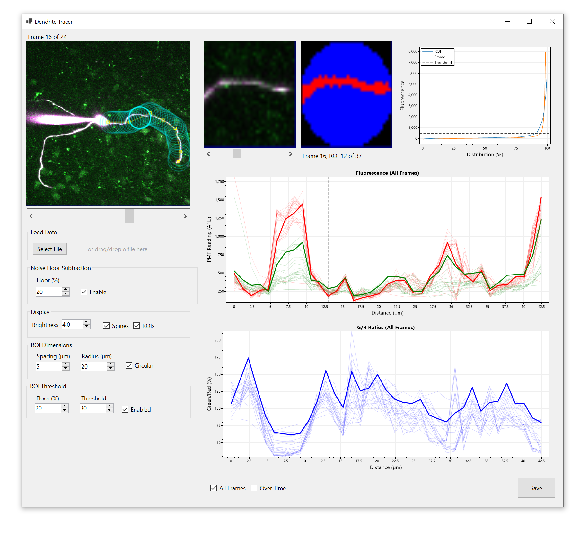

# Dendrite Tracer

Dendrite Tracer is a desktop application facilitating analysis of 5D images to measure spatial distribution and time dynamics of calcium fluorescence along the length of neuron dendrites.

**Project Status:** This software is pre-alpha, intended for private use, and is not supported.